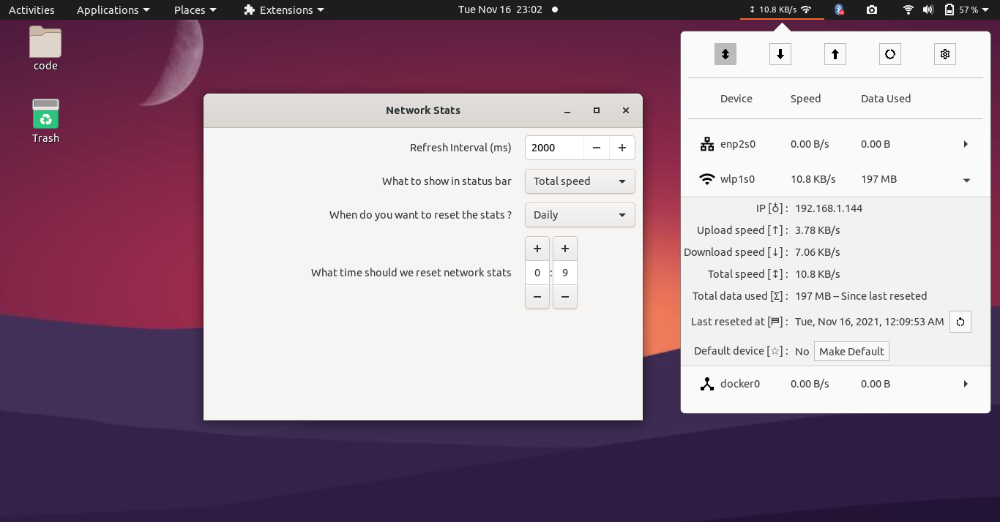

# gnome-network-stats
Gnome extension for showing internet upload, download speed and per day data usage.

<div>
<p><a href="#"></a></p>
<h1>Network Stats</h1>
<p>
</div>

## Roadmap
See details on <a href="TODO.md">Todo page</a>.
## Installation

### install from https://extensions.gnome.org

The latest reviewed version can be found at
<div>
<a href="https://extensions.gnome.org/extension/4308/network-stats/" >

</a>
</div>

### Download from github.com and install yourself

The latest development version can be installed manually with these commands:

```
git clone https://github.com/noroadsleft000/gnome-network-stats.git

cd gnome-network-stats

./commands.sh build

./commands.sh install
```

Then go to https://extensions.gnome.org/local/ to turn on the extension or use
gnome-tweak-tool to enable it.


## Commands
### build extension
```
./commands.sh build
```
### install extension
```
./commands.sh install
```
### uninstall extension
```
./commands.sh uninstall
```
### enable extension
```
./commands.sh enable
```
### disable extension
```
./commands.sh disable
```
### pack the extension to zip file
```
./commands.sh pack
```
### launch a nested wayland session for debugging the extension
```
./commands.sh debug
```

## Known issues
### ERROR while updating extension from store.
Universal solution of all problems `"Restart your machine"` will work. Or you can restart the gnome-shell alone.

restart gnome-shell on X11:
```
"Alt + F2", "r + Enter"
```

restart gnome-shell on wayland or (ubuntu >= 21.10):
```
busctl --user call org.gnome.Shell /org/gnome/Shell org.gnome.Shell Eval s 'Meta.restart("Restarting…")'
```
kill gnome shell, works for both X11 and wayland:
```
killall -9 gnome-shell
```

still facing some error? report it by creating a bug.

## Reporting a Bug

When reporting a bug, please include debugging output from `gnome-shell`.

You can capture the logs with one of these commands:
```
journalctl -f -o cat GNOME_SHELL_EXTENSION_UUID=network-stats@gnome.noroadsleft.xyz

journalctl /usr/bin/gnome-shell | grep network-stats

journalctl -f -o cat /usr/bin/gnome-shell
```

## Developer resources
- [Gnome Javascript guide](https://gjs.guide)
- [Basic Gnome extension guide](https://gjs.guide/extensions/development/creating.html#gnome-extensions-tool)
- [Gnome JS API documentation](https://gjs-docs.gnome.org/)
- [JS API documentaion - Unofficial](https://www.roojs.com/seed/gir-1.2-gtk-3.0/seed)
- [Gnome JS API source code](https://github.com/GNOME/gnome-shell/tree/main/js)

## Contibutors
Contributions are always welcome, fork this repository make your changes.
and then generate a pull request.


## License

GNOME Shell Extensions are distributed under the terms of the GNU General
Public License. This extension is shipped under MIT License.
